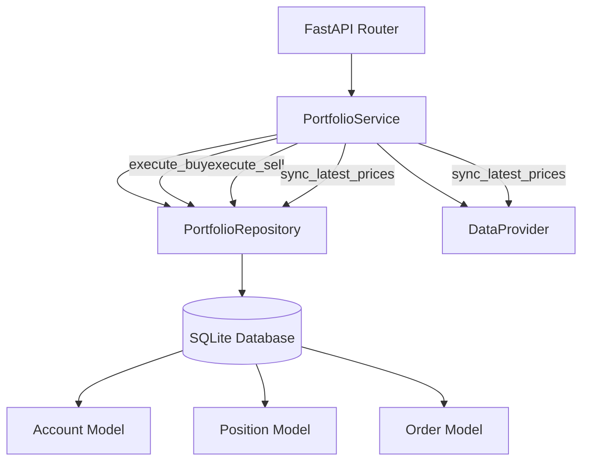

# 组合管理模块实现计划

## 概述

实现完整的组合管理系统，包含 Account（单例）、Position（一对多）和 Order（不可变账本）模型，遵循 FastAPI Router → Service → Repository → SQLite 架构模式。

## 架构流程图

## 任务 1: 数据库模型 (`src/database.py`)

### 1.1 添加 Account 模型

- **位置**: `src/database.py` (第 109 行之后，ErrorLog 之前)
- **字段**:
  - `id`: Integer, primary_key=True, default=1 (单例约束)
  - `total_asset`: Float, nullable=False, default=0.0 (总资产)
  - `cash`: Float, nullable=False, default=0.0 (现金)
  - `market_value`: Float, nullable=False, default=0.0 (市值)
  - `frozen_cash`: Float, nullable=False, default=0.0 (冻结资金)
  - `created_at`: DateTime, default=datetime.now
  - `updated_at`: DateTime, default=datetime.now, onupdate=datetime.now
- **约束**: 在 `id` 上添加唯一约束以强制执行单例

### 1.2 将 PortfolioPosition 迁移为 Position 模型

- **位置**: `src/database.py` (替换第 96 行附近的现有 `PortfolioPosition` 类)
- **字段**:
  - `id`: Integer, primary_key=True, autoincrement=True
  - `ts_code`: String(20), nullable=False, unique=True (每只股票一个持仓)
  - `name`: String(100), nullable=False (股票名称)
  - `total_vol`: Integer, nullable=False, default=0 (总持仓量)
  - `avail_vol`: Integer, nullable=False, default=0 (可用持仓量，用于 T+1)
  - `avg_price`: Float, nullable=False, default=0.0 (平均成本价)
  - `current_price`: Float, nullable=True (最新市价)
  - `profit`: Float, nullable=False, default=0.0 (浮动盈亏)
  - `profit_pct`: Float, nullable=False, default=0.0 (盈亏百分比)
  - `created_at`: DateTime, default=datetime.now
  - `updated_at`: DateTime, default=datetime.now, onupdate=datetime.now
- **迁移策略**: 
  - 直接移除旧的 `PortfolioPosition` 表（测试数据，不必保留）
  - 创建新的 `positions` 表
  - 更新所有引用 `PortfolioPosition` 的代码，改为使用新的 `Position` 模型

### 1.3 添加 Order 模型

- **位置**: `src/database.py` (Position 模型之后)
- **字段**:
  - `order_id`: String(36), primary_key=True (UUID)
  - `trade_date`: String(8), nullable=False (YYYYMMDD 格式)
  - `ts_code`: String(20), nullable=False (股票代码)
  - `action`: String(10), nullable=False (BUY/SELL)
  - `price`: Float, nullable=False, gt=0 (成交价格)
  - `volume`: Integer, nullable=False, gt=0 (成交数量)
  - `fee`: Float, nullable=False, default=0.0 (手续费)
  - `status`: String(20), nullable=False, default='FILLED' (FILLED/CANCELLED)
  - `strategy_tag`: String(20), nullable=True (买入订单的策略标签)
  - `reason`: String(200), nullable=True (卖出订单的原因)
  - `created_at`: DateTime, default=datetime.now
- **约束**: 不可变（无更新方法，仅插入）

### 1.4 数据库迁移函数

- 添加 `_migrate_portfolio_models()` 函数以：
  - 如果不存在则创建 Account 表
  - 如果不存在则创建 Position 表
  - 如果不存在则创建 Order 表
  - 添加索引: `idx_position_ts_code`, `idx_order_trade_date`, `idx_order_ts_code`
- 在模块初始化时调用迁移

## 任务 2: 仓库层 (`src/repositories/portfolio_repository.py`)

### 2.1 更新 PortfolioRepository 类

- **位置**: `src/repositories/portfolio_repository.py`
- **导入更改**: 更新导入以使用新模型（从 `src.database` 导入 `Account`, `Position`, `Order`）

### 2.2 实现必需的方法

#### `get_account() -> Account`

- 查询 id=1 的 Account
- 返回 Account 模型实例或 None
- 处理 Account 不存在的情况（返回 None，让服务层处理初始化）

#### `get_positions() -> List[Position]`

- 查询所有 Position 记录
- 返回 Position 模型实例列表
- 按 `ts_code` 排序

#### `get_position(ts_code: str) -> Optional[Position]`

- 按 `ts_code` 查询 Position
- 返回 Position 模型实例或 None

#### `create_order(order_data: Dict) -> Order` (事务性)

- **关键**: 必须是原子事务
- 步骤:

  1. 计算订单成本: `price * volume + fee`
  2. 如果 action == 'BUY':

     - 检查 Account.cash >= order_cost (如果不足则抛出异常)
     - 扣除现金: `Account.cash -= order_cost`
     - 更新或创建 Position:
       - 如果 Position 存在: 更新 `total_vol`, `avail_vol`，重新计算 `avg_price`
       - 如果 Position 不存在: 创建新 Position
     - 更新 `Account.market_value` (从所有持仓重新计算)

  1. 如果 action == 'SELL':

     - 检查 Position 存在且 `avail_vol >= volume` (如果不足则抛出异常)
     - 增加现金: `Account.cash += (price * volume - fee)`
     - 更新 Position: `total_vol -= volume`, `avail_vol -= volume`
     - 如果 `total_vol == 0`: 删除 Position
     - 更新 `Account.market_value`

  1. 创建状态为 'FILLED' 的 Order 记录
  2. 重新计算 `Account.total_asset = Account.cash + Account.market_value`
  3. 提交事务（出错时回滚）

- **错误处理**: 为"资金不足"和"持仓不存在"抛出自定义异常

#### `update_positions_market_value(prices_dict: Dict[str, float]) -> None`

- 批量更新 `prices_dict` 中所有 `ts_code` 的 `Position.current_price`
- 对于每个 Position:
  - 更新 `current_price`
  - 重新计算 `profit = (current_price - avg_price) * total_vol`
  - 如果 `avg_price > 0`，重新计算 `profit_pct = (current_price - avg_price) / avg_price * 100`
- 重新计算 `Account.market_value = sum(position.current_price * position.total_vol for all positions)`
- 重新计算 `Account.total_asset = Account.cash + Account.market_value`
- 使用单个事务进行所有更新

### 2.3 辅助方法

- `_recalculate_account_assets(session)`: 内部方法，重新计算 Account.market_value 和 total_asset
- `_to_dict(model)`: 将 ORM 模型转换为字典（如需要向后兼容）

## 任务 3: 服务层 (`api/services/portfolio_service.py`)

### 3.1 更新 PortfolioService 类

- **位置**: `api/services/portfolio_service.py`
- 保持现有的构造函数模式（DataProvider, ConfigManager, Repository）

### 3.2 实现必需的方法

#### `execute_buy(ts_code: str, price: float, volume: int, strategy_tag: str = None) -> Dict`

- **验证**:
  - 检查 Account 是否存在（如果未初始化则抛出异常）
  - 计算所需现金: `price * volume * (1 + 0.002)` (0.002 = 0.2% 手续费)
  - 检查 `Account.cash >= required_cash` (如果不足则抛出"资金不足")
- **执行**:
  - 调用 `repository.create_order()`，参数包括:
    - `action='BUY'`
    - `price`, `volume`
    - `fee = price * volume * 0.002`
    - `strategy_tag`
    - `trade_date` (从 `src.strategy.get_trade_date()` 获取)
- **返回**: 包含 order_id、status 等的订单字典

#### `execute_sell(ts_code: str, price: float, volume: int, reason: str = None) -> Dict`

- **验证**:
  - 按 `ts_code` 获取 Position（如果不存在则抛出"持仓不存在"）
  - 检查 `Position.avail_vol >= volume` (如果不足则抛出"可用数量不足")
- **执行**:
  - 调用 `repository.create_order()`，参数包括:
    - `action='SELL'`
    - `price`, `volume`
    - `fee = price * volume * 0.002`
    - `reason`
    - `trade_date`
- **返回**: 订单字典

#### `sync_latest_prices() -> Dict`

- **步骤**:

  1. 从仓库获取所有 Position
  2. 提取 `ts_code` 列表
  3. 调用 `DataProvider` 获取实时价格:

     - 对每个 `ts_code` 使用 `data_provider._tushare_client.get_daily()`
     - 或使用批量调用（如果可用）
     - 获取每只股票的最新 `close` 价格

  1. 构建 `prices_dict: Dict[str, float]`，映射 `ts_code -> price`
  2. 调用 `repository.update_positions_market_value(prices_dict)`

- **返回**: 包含 `updated_count`、`total_positions`、`timestamp` 的字典

### 3.3 其他辅助方法

- `get_account() -> Dict`: 围绕 `repository.get_account()` 的包装器
- `get_positions() -> List[Dict]`: 围绕 `repository.get_positions()` 的包装器（转换为字典）
- `get_position(ts_code: str) -> Optional[Dict]`: 围绕 `repository.get_position()` 的包装器
- `_get_current_price(ts_code: str) -> Optional[float]`: 重用当前实现中的现有方法

### 3.4 错误处理

- 在 `api/utils/exceptions.py` 中创建自定义异常:
  - `InsufficientFundsError` (资金不足错误)
  - `PositionNotFoundError` (持仓不存在错误)
  - `InsufficientVolumeError` (可用数量不足错误)
  - `AccountNotInitializedError` (账户未初始化错误)

## 任务 4: 数据库会话管理

### 4.1 事务处理

- 确保 `create_order()` 使用正确的事务作用域
- 使用 `src/database.py` 中的 `_session_scope()` 上下文管理器
- 所有 Account 和 Position 更新必须是原子的

### 4.2 账户初始化

- 由于需要手动初始化，在仓库中创建辅助方法:
  - `initialize_account(initial_cash: float) -> Account`
  - 检查 Account(id=1) 是否存在，如果不存在则创建
  - 设置 `cash = initial_cash`, `total_asset = initial_cash`，其他为 0.0

## 任务 5: T+1 交易规则实现

### 5.1 可用数量逻辑

- 买入时: `avail_vol` 保持为 0，直到下一个交易日
- 卖出时: 只能卖出 `avail_vol`（不能卖出 `total_vol`）
- 需要实现每日更新 `avail_vol = total_vol`（单独的任务/调度器）

### 5.2 买入时的持仓更新

- 如果 Position 存在:
  - `total_vol += volume`
  - `avail_vol` 保持不变（T+1 规则）
  - `avg_price = (old_avg_price * old_total_vol + price * volume) / new_total_vol`
- 如果 Position 不存在:
  - 创建 `total_vol = volume`, `avail_vol = 0`, `avg_price = price`

## 任务 6: 测试实现

### 6.1 单元测试 - 数据库模型 (`tests/test_portfolio_models.py`)

- **测试 Account 模型**:
  - 测试单例约束（id=1 唯一性）
  - 测试字段默认值
  - 测试 total_asset = cash + market_value 约束

- **测试 Position 模型**:
  - 测试 ts_code 唯一性约束
  - 测试字段默认值
  - 测试 profit 和 profit_pct 计算逻辑

- **测试 Order 模型**:
  - 测试不可变性（只读）
  - 测试 action 枚举值（BUY/SELL）
  - 测试 status 枚举值（FILLED/CANCELLED）

### 6.2 单元测试 - 仓库层 (`tests/test_portfolio_repository.py`)

- **测试 PortfolioRepository**:
  - `get_account()`: 测试获取账户，不存在时返回 None
  - `get_positions()`: 测试获取所有持仓
  - `get_position(ts_code)`: 测试按代码获取持仓
  - `create_order()`: 
    - 测试买入订单的原子事务（资金扣除、持仓创建/更新）
    - 测试卖出订单的原子事务（持仓减少、资金增加）
    - 测试资金不足异常
    - 测试可用数量不足异常
    - 测试持仓不存在异常
    - 测试事务回滚（出错时）
  - `update_positions_market_value()`: 测试批量价格更新和资产重算
  - `initialize_account()`: 测试账户初始化

### 6.3 单元测试 - 服务层 (`tests/test_portfolio_service.py`)

- **测试 PortfolioService**:
  - `execute_buy()`:
    - 测试资金验证
    - 测试手续费计算（0.2%）
    - 测试账户未初始化异常
    - 测试成功执行流程
  - `execute_sell()`:
    - 测试持仓存在验证
    - 测试 T+1 可用数量验证
    - 测试成功执行流程
  - `sync_latest_prices()`:
    - 测试从 DataProvider 获取价格
    - 测试批量更新持仓价格
    - 测试账户市值重算
  - `get_account()`, `get_positions()`, `get_position()`: 测试包装器方法

### 6.4 集成测试 - 更新现有测试 (`tests/e2e/test_portfolio_e2e.py`)

- **更新测试用例以适配新模型**:
  - 更新 fixtures 使用新的 Account、Position、Order 模型
  - 更新 API 测试以使用新的接口（execute_buy/execute_sell）
  - 测试完整的买入/卖出流程
  - 测试价格同步功能
  - 测试账户资产计算

### 6.5 测试执行

- 运行所有单元测试: `pytest tests/test_portfolio_*.py -v`
- 运行集成测试: `pytest tests/e2e/test_portfolio_e2e.py -v`
- 运行完整测试套件: `pytest tests/ -k portfolio -v`
- 生成覆盖率报告: `pytest --cov=src.repositories.portfolio_repository --cov=api.services.portfolio_service --cov-report=html`

## 实现顺序

1. **数据库模型** (任务 1): 创建所有三个模型和迁移函数，移除旧的 PortfolioPosition 表
2. **错误处理** (任务 3.4): 创建自定义异常（在实现服务层之前）
3. **仓库层** (任务 2): 使用正确的事务实现所有仓库方法
4. **服务层** (任务 3): 实现带有验证和错误处理的服务方法
5. **单元测试** (任务 6.1-6.3): 为模型、仓库层和服务层编写单元测试
6. **集成测试** (任务 6.4): 更新现有 E2E 测试以适配新接口
7. **测试执行** (任务 6.5): 运行所有测试，修复发现的问题

## 关键约束

- **严格执行**: `Account.total_asset = Account.cash + Account.market_value` 必须始终成立
- **事务安全**: 所有订单执行必须是原子的
- **T+1 规则**: 只能卖出 `avail_vol`，不能卖出 `total_vol`
- **手续费计算**: 所有交易 0.2% (0.002)
- **持仓唯一性**: 每个 `ts_code` 一个 Position（通过唯一约束强制执行）

## 要修改的文件

1. `src/database.py` - 添加 Account、Position、Order 模型
2. `src/repositories/portfolio_repository.py` - 重写仓库方法
3. `api/services/portfolio_service.py` - 重写服务方法
4. `api/utils/exceptions.py` - 添加自定义异常（如果不存在则创建）

## 注意事项

- **数据迁移**: 直接移除旧的 `PortfolioPosition` 表，不保留测试数据
- **账户初始化**: 账户初始化应通过单独的管理端点或脚本完成（`initialize_account()` 方法）
- **T+1 规则**: T+1 数量更新需要每日作业（超出此范围），买入时 `avail_vol` 保持为 0
- **数据库索引**: 已在迁移函数中添加索引以提高查询性能
- **测试覆盖**: 确保所有关键路径都有测试覆盖，特别是事务处理和错误场景
- **向后兼容**: 更新所有引用 `PortfolioPosition` 的代码和测试，使用新的 `Position` 模型